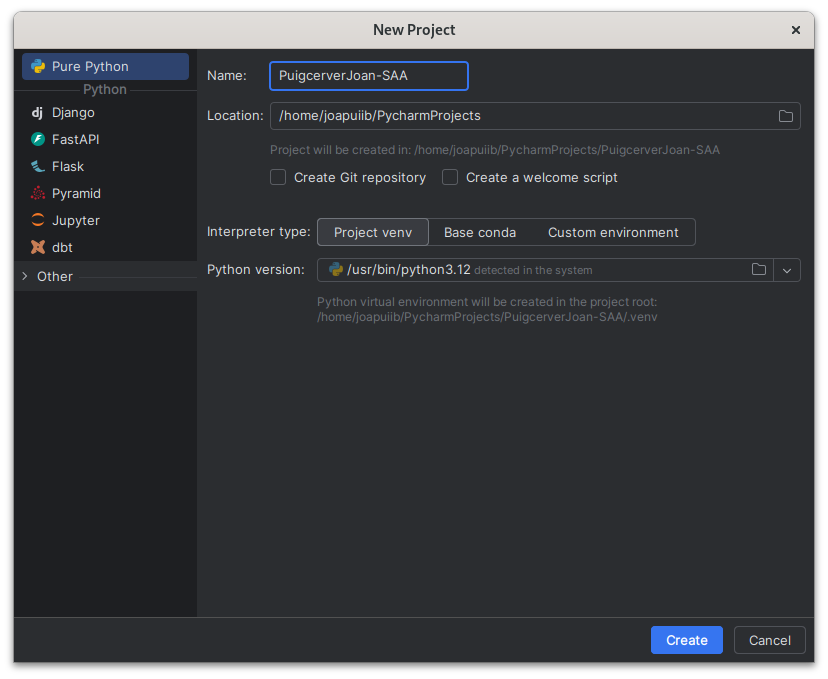

## Objectius
L'objectiu d'aquest material és configurar l'entorn de desenvolupament
en ordinadors amb sistema operatiu Windows o distribucions de Linux basades en Debian,
com Ubuntu o Linux Mint.

En aquest manual s'instal·larà i es configuraran les següent eines:

- [Python 3](https://www.python.org/){target=_blank}: Llenguatge de programació.
- [PyCharm](https://www.jetbrains.com/pycharm/){target=_blank}: Entorn de desenvolupament integrat.

!!! info
    Podeu utilitzar l'entorn de desenvolupament que vulgueu,
    però heu de saber configurar-lo per a Python 3.

    El professorat no donarà suport a altres entorns de desenvolupament.

## Python 3
Python 3 està disponible a https://www.python.org/ per a Windows, macOS i Linux.

A Linux, Python 3 ja ve instal·lat per defecte a pràcticament totes les distribucions.

## PyCharm
PyCharm està disponible a https://www.jetbrains.com/pycharm/ per a Windows, macOS i Linux.

Cal descarregar la versió __Community__, que és de codi obert i gratuïta.

## Creació de projecte
Per a començar a treballar, heu de crear un projecte a PyCharm.

Jo he triat les següents opcions:

- __Project type__: Pure Python
- __Nome del projecte__: `CognomNom-SAA`
- __Location__: Per defecte.
- __Interpreter__: Python 3.12
- __Interpreter type__: Virtualenv
- __Create Git repository__: Sí

!!! important
    S'utilitzara un __entorn virtual__ per a aïllar les dependències del projecte
    respecte de les del sistema.

!!! tip
    Vos recomane crear un repositori de :material-git: Git per gestionar el vostre codi.



## Instal·lació de dependències
En aquest mòdul farem servir les llibreries especificades al fitxer `requirements.txt`,
que hauràs de situar a l'arrel del projecte.

```txt title="requirements.txt"
--8<-- "docs/files/requeriments.txt"
```

!!! tip
    En el meu cas, s'ha situat a `PuigcerverJoan-SAA/requirements.txt`.

Per instal·lar les dependències, obriu un terminal a PyCharm
i executeu la següent comanda:

```shellconsole
(.venv) jpuigcerver@fedora:~/PuigcerverJoan-SAA (main) $ pip install -r requirements.txt
```

!!! notice
    Fixeu-vos que el __entorn virtual__ està activat: `(.venv)`.

    Si no ho està, el podeu activar amb la següent comanda:

    ```shellconsole
    jpuigcerver@fedora:~/PuigcerverJoan-SAA (main) $ source .venv/bin/activate
    ```
