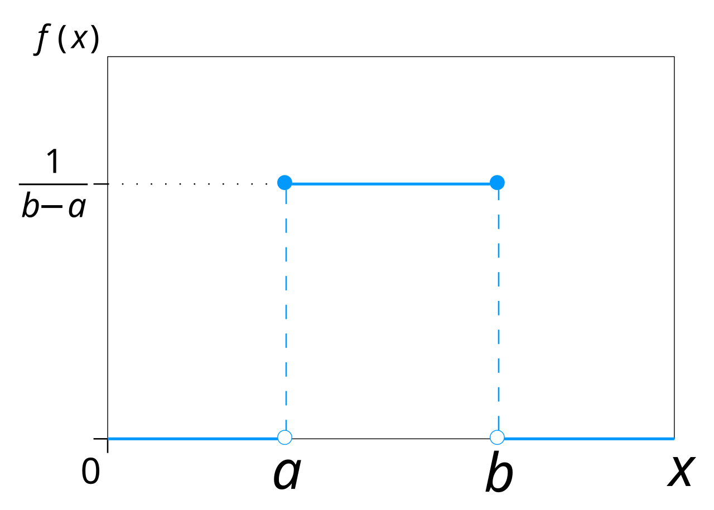
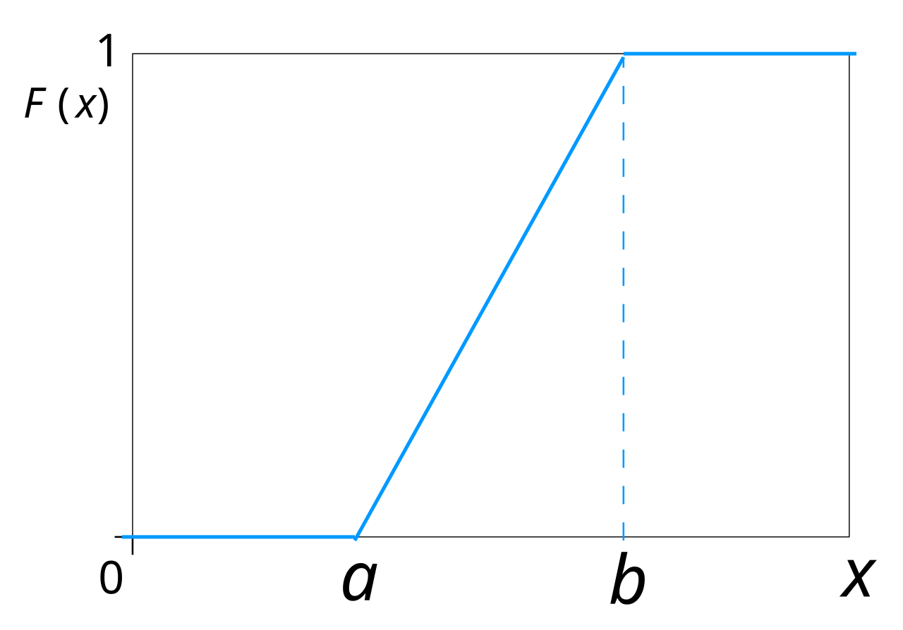
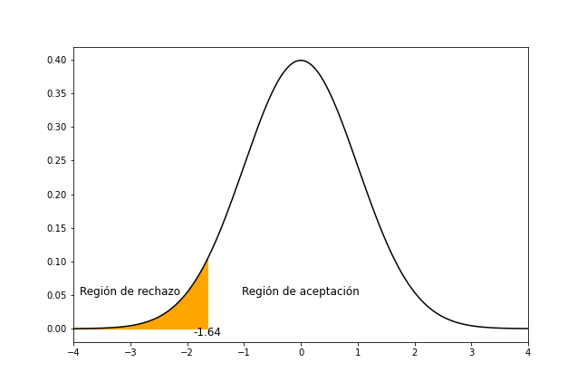

## Distribucions de probabilitat
En probabilitats i estadistica, una __distibució de probabilitat__ és una funció que indica la probabilitat que una __variable aleatòria__ prenga un valor determinat.

Una __variable aleatòria__ és una funció que assigna un valor numèric a cada resultat possible d'un __experiment aleatori__.

!!! example "Variable aleatòria: Catan"
    En el joc de taula Catan, el resultat de llançar dos daus és una variable aleatòria.

    Considerem l'__experiència aleatòria__ del llançament de dos daus. El conjunt de resultats possibles és:

    $$\Omega = \{(1,1), (1,2), \ldots, (1,6), (2,1), (2,2), \ldots, (5,6), (6,6)\}$$

    on cada parell $(i,j)$ representa el resultat obtingut en cada dau.

    La variable aleatòria $X$, que assigna a cada possible resultat la suma dels dos daus, és:

    $$X((i,j)) = i+j$$

    Els valors posibles de la variable aleatòria $X$ són:

    $$X = \{2, 3, 4, 5, 6, 7, 8, 9, 10, 11, 12\}$$

### Distribució de probabilitat discreta
Una distribució de probabilitat és __discreta__ si la variable aleatòria és també discreta, és a dir,
si la variable aleatòria pren valors en un conjunt __finit o numerable__.

!!! example "Catan"
    En l'example anterior, la variable aleatòria $X$ és discreta, ja que pren valors en un conjunt finit.

    Per calcular la distribució de probabilitat de la variable aleatòria $X$,
    hem de calcular la probabilitat de cada valor possible de la variable aleatòria.

    El nombre total de resultats possibles és $6 \times 6 = 36$.

    | Suma $i$ | Resultats $\{X = i\}$ | Probabilitat $P(X = i)$ |
    |----------|-----------------------|-------------------------|
    | 2        | $\{(1,1)\}$           | $\frac{1}{36} \approx 0.0278$ |
    | 3        | $\{(1,2), (2,1)\}$    | $\frac{2}{36} \approx 0.0556$ |
    | 4        | $\{(1,3), (2,2), (3,1)\}$ | $\frac{3}{36} \approx 0.0833$ |
    | 5        | $\{(1,4), (2,3), (3,2), (4,1)\}$ | $\frac{4}{36} \approx 0.1111$ |
    | 6        | $\{(1,5), (2,4), (3,3), (4,2), (5,1)\}$ | $\frac{5}{36} \approx 0.1389$ |
    | 7        | $\{(1,6), (2,5), (3,4), (4,3), (5,2), (6,1)\}$ | $\frac{6}{36} \approx 0.1667$ |
    | 8        | $\{(2,6), (3,5), (4,4), (5,3), (6,2)\}$ | $\frac{5}{36} \approx 0.1389$ |
    | 9        | $\{(3,6), (4,5), (5,4), (6,3)\}$ | $\frac{4}{36} \approx 0.1111$ |
    | 10       | $\{(4,6), (5,5), (6,4)\}$ | $\frac{3}{36} \approx 0.0833$ |
    | 11       | $\{(5,6), (6,5)\}$ | $\frac{2}{36} \approx 0.0556$ |
    | 12       | $\{(6,6)\}$ | $\frac{1}{36} \approx 0.0278$ |

    ```mermaid
    xychart-beta
        title "Distribució de probabilitat la suma de dos daus"
        x-axis "Suma dels dos daus" [2, 3, 4, 5, 6, 7, 8, 9, 10, 11, 12]
        y-axis "Probabilitat en %" 0 --> 20
        bar [2.78, 5.56, 8.33, 11.11, 13.89, 16.67, 13.89, 11.11, 8.33, 5.56, 2.78]
    ```

#### Distribució de Bernoulli
La __distribució de Bernoulli__ és una distribució de probabilitat discreta que modela 
un experiment aleatori amb dos possibles resultats: __èxit o fracàs__.

- Quan és __èxit__, la variable aleatòria pren el valor 1.
- Quan és __fracàs__, la variable aleatòria pren el valor 0.

La distribució de Bernoulli depèn de dos paràmetres:

- La probabilitat d'èxit $p$.
- La probabilitat de fracàs $q$.

On sempre es compleix que $p + q = 1$.

La funció de probabilitat de la distribució de Bernoulli és:

$$P(X = x) = \begin{cases}
    p & \text{si } x = 1 \\
    q & \text{si } x = 0 \\
    0 & \text{altrament}
\end{cases}$$

O escrit com a fòrmula, on $x \in \{0, 1\}$:

$$P(X = x) = p^x \cdot (1 - p)^{1-x}$$

!!! example "Llançament d'una moneda"
    En el llançament d'una moneda equilibrada, la variable aleatòria $X$ que indica si el resultat
    és cara o creu és una variable de Bernoulli, on $p = q = 0.5$.


#### Distribució binomial
La __distribució binomial__ és una distribució de probabilitat discreta que modela
el nomre d'èxits en una seqüència de $n$ experiments amb una probabilitat d'èxit $p$.

$$X \sim B(n, p)$$

És a dir, la distribució binomial modela el nombre de vegades que es repeteix un esdeveniment de Bernoulli.

La funció de probabilitat de la distribució binomial és la probabilitat de obtindre exactament $k$ èxits
en $n$ experiments:

$$P(X = k) = \binom{n}{k} \cdot p^k \cdot (1 - p)^{n-k}$$

on el [coeficient binomial](https://ca.wikipedia.org/wiki/Coeficient_binomial), és el
nombre de combinacions en què es poden escollir $k$ elements d'un conjunt de $n$ elements:

$$\binom{n}{k} = \frac{n!}{k! \cdot (n-k)!}$$

!!! example "Dau igual a 6"
    En el llançament d'un dau equilibrat, la variable aleatòria $X$ que indica si el resultat
    és un 6 és una variable de Bernoulli, on $p = \frac{1}{6}$.

    Si llancem el dau 10 vegades, la variable aleatòria $Y$ que indica el nombre de vegades que ha sortit un 6
    és una variable binomial amb $n = 10$ i $p = \frac{1}{6}$.

    $$X \sim B(10, \frac{1}{6})$$

    La probabilitat de no treure cap 6 és:

    $$P(Y = 0) = \binom{10}{0} \cdot \left(\frac{1}{6}\right)^0 \cdot \left(1 - \frac{1}{6}\right)^{10} \approx 0.16151$$

    ```mermaid
    xychart-beta
        title "Distribució de probabilitat de llançar un dau 10 vegades"
        x-axis "Nombre de 6" [0, 1, 2, 3, 4, 5, 6, 7, 8, 9, 10]
        y-axis "Probabilitat en %" 0 --> 35
        bar [16.151, 32.301, 29.071, 15.505, 5.427, 1.302, 0.217, 0.025, 0.002, 0.000, 0.000]
    ```

#### Distribució de Poisson
La __distribució de Poisson__ és una distribució de probabilitat discreta que modela
el nombre d'ocurrències d'un esdeveniment en un interval de temps o espai, sempre
i quan aquestes ocurrències siguin independents i la seva freqüència siga constant
independentment del temps des de l'última ocurrència.

La funció de probabilitat de la distribució de Poisson és:

$$P(X = k) = \frac{\lambda^k \cdot e^{-\lambda}}{k!}$$

on $\lambda$ és la mitjana del nombre (o el nombre esperat) d'ocurrències
en l'interval.

!!! example "Central 112"
    La central d'emergències 112 rep una mitjana de 5 trucades per minut.

    La variable aleatòria $X$ que indica el nombre de trucades que rep la central en un minut
    és una variable de Poisson amb $\lambda = 5$ si les trucades són independents.

    La probabilitat que la central rebi exactament 3 trucades en un minut és:

    $$P(X = 3) = \frac{5^3 \cdot e^{-5}}{3!} \approx 0.14037$$

    ```mermaid
    xychart-beta
        title "Distribució de probabilitat de trucades a la central 112"
        x-axis "Nombre de trucades" [0, 1, 2, 3, 4, 5, 6, 7, 8, 9, 10, 11, 12]
        y-axis "Probabilitat en %" 0 --> 20
        bar [0.674, 3.369, 8.422, 14.037, 17.546, 17.546, 14.621, 10.444, 6.527, 3.626, 1.813, 0.825, 0.347]
    ```

    La probabilitat __acumulada__ de rebre $x$ o menys trucades en un minut és:

    $$F(x)=P(X≤x)$$

    ```mermaid
    xychart-beta
        title "Distribució de probabilitat acumulada de trucades a la central 112"
        x-axis "Nombre de trucades" [0, 1, 2, 3, 4, 5, 6, 7, 8, 9, 10, 11, 12]
        y-axis "Probabilitat en %" 0 --> 100
        line [0.674, 4.043, 12.465, 26.502, 44.048, 61.594, 76.215, 86.659, 93.186, 96.812, 98.625, 99.450, 99.797]
    ```


### Distribució de probabilitat contínua
Una distribució de probabilitat és __contínua__ si la variable aleatòria és contínua, és a dir,
si la variable aleatòria pren valors en un conjunt __no numerable__ (infinit) de valors.

En aquest cas, la funció de probabilitat és una __funció de densitat de probabilitat__,
que indica la probabilitat que la variable aleatòria prengui un valor en un interval.

$$P(a \leq X \leq b) = \int_a^b f(x) \, dx$$

!!! note
    La probabilitat que la variable aleatòria prenga un valor exacte és sempre zero.

#### Distribució uniforme contínua
La __distribució uniforme contínua__ és una distribució de probabilitat contínua que modela
una variable aleatòria que pren valors en un interval amb la mateixa probabilitat.

La funció de densitat de probabilitat de la distribució uniforme és:

$$
f(x) = \begin{cases}
    \frac{1}{b-a} & \text{si } a \leq x \leq b \\
    0 & \text{altrament}
\end{cases}
$$

{: .center style="max-height: 300px"}

La funció de distribució de probabilitat acumulada és:

$$
F(x) = \begin{cases}
    0 & \text{si } x < a \\
    \frac{x-a}{b-a} & \text{si } a \leq x \leq b \\
    1 & \text{si } x > b
\end{cases}
$$

{: .center style="max-height: 300px"}


!!! example "Fabricació de llapis"
    En una fàbrica de llapis, la longitud dels llapis és una variable aleatòria contínua
    que segueix una distribució uniforme en l'interval $[10, 20]$ cm.

    La probabilitat que un llapis fabricat tinga una longitud entre 15 i 17 cm és:

    $$P(15 \leq X \leq 17) = F(17) - F(15) = \frac{17-10}{20-10} - \frac{15-10}{20-10} = \frac{7}{10} - \frac{5}{10} = \frac{2}{10} = 0.2$$
    

#### Distribució normal
La __distribució normal__ és una distribució de probabilitat contínua que modela
variables aleatòries que segueixen una distribució simètrica al voltant d'un valor mitjà,
on existeiex poc valors extrems i molts valors prop del mitjà.

És el model més comú en estadística, ja que existeixen moltes variables associades
a fenòmens naturals que segueixen aquesta distribució.

Aquesta distribució es caracteritza per una _campana de Gauss_ a partir d'un __valor mitjà $\mu$__,
sobre el qual el 50% dels valors queda a cada costat, i una __desviació estàndard $\sigma$__.

$$X \sim N(\mu, \sigma)$$

La funció de densitat de probabilitat de la distribució normal és:

$$f(x) = \frac{1}{\sigma \sqrt{2\pi}} \cdot e^{-\frac{(x-\mu)^2}{2\sigma^2}}$$

{: .center style="max-height: 300px"}

Alguna de les propietats de la distribució normal són:

- La mitjana, la mediana i la moda coincideixen.
- És simètrica respecte al valor mitjà.
    - L'interval $[\mu - \sigma, \mu + \sigma]$ conté el 68.27% dels valors.
    - L'interval $[\mu - 2\sigma, \mu + 2\sigma]$ conté el 95.45% dels valors.
    - L'interval $[\mu - 3\sigma, \mu + 3\sigma]$ conté el 99.73% dels valors.


A partir de la versió 3.8 de Python, la llibreria estàndard `statistics` inclou la classe
[`NormalDist`](https://docs.python.org/3.8/library/statistics.html?highlight=normaldist#statistics.NormalDist)
que permet treballar amb distribucions normals.


!!! example "Alçada d'una població"
    L'alçada d'una població segueix una distribució normal amb una mitjana de 170 cm i una desviació estàndard de 10 cm.

    ```mermaid
    xychart-beta
        title "Distribució de probabilitat de l'alçada d'una població"
        x-axis "Alçada en cm" [140, 145, 150, 155, 160, 165, 170, 175, 180, 185, 190, 195, 200]
        y-axis "" 0 --> 5
        line [0.044318, 0.175283, 0.539910, 1.295176, 2.419707, 3.520653, 3.989423, 3.520653, 2.419707, 1.295176, 0.539910, 0.175283, 0.044318]
    ```

    !!! note
        Aquest càlcul es pot fer mitjançant [__unitats tipificades (standard-score)__](#unitat-tipificada-standard-score)
        i la [__taula de la distribució normal__](https://en.wikipedia.org/wiki/Standard_normal_table#Cumulative_(less_than_Z)){:target="_blank"}.

    La probabilitat que una persona triada a l'atzar tinga una alçada entre 160 i 180 cm és:

    $$P(160 \leq X \leq 180) = 0.6826$$

    La probabilitat que una persona triada a l'atzar tinga una alçada més gran que 190 cm és:

    $$P(X > 190) = 1 - P(X \leq 190) = 1 - 0.9772 = 0.0228$$

    ```python
    from statistics import NormalDist

    height_dist = NormalDist(mu=170, sigma=10)

    # Probability of a person being taller than 160 cm and shorter than 180 cm
    p = height_dist.cdf(180) - height_dist.cdf(160)
    print("Probability of a person being taller than 160 cm and shorter than 180 cm:", p)

    # Probability of a person being taller than 190 cm
    p = 1 - height_dist.cdf(190)
    print("Probability of a person being taller than 190 cm:", p)
    ```
    /// html | div.result
    ```text
    Probability of a person being taller than 160 cm and shorter than 180 cm: 0.6826
    Probability of a person being taller than 190 cm: 0.02275
    ```
    ///


#### Unitat tipificada (standard-score)
La __unitat tipificada (*standard-score o z-score*)__
és una mesura que serveix per comparar una observació
dins d'una distribució estadística.

Aquesta unitat indiquen el nombre de desviacions típiques que una observació
està per damunt o per davall de la mitjana.

La unitat tipificada es calcula com:

$$z = \frac{x - \mu}{\sigma}$$

!!! example "Unitat tipificada de l'alçada"
    Donada una població amb una mitjana de 170 cm i una desviació estàndard de 10 cm,
    calculem les unitats tipificades de les alçades 160 i 180 cm.

    1. Per a $x = 160$ cm:

        $$z_1 = \frac{160 - 170}{10} = -1$$

    2. Per a $x = 180$ cm:
        
        $$z_2 = \frac{180 - 170}{10} = 1$$
    

#### Distribució normal estàndard
La __distribució normal estàndard__ és cas especial d'una distribució normal, que té una mitjana $\mu = 0$
i una desviació estàndard $\sigma = 1$.

$$X \sim N(0, 1)$$

A Python, inicialitzar una distribució normal estàndard es fa amb la classe `NormalDist` sense paràmetres.

```python
from statistics import NormalDist

std_normal_dist = NormalDist() # mu=0, sigma=1
```

Aquesta distribució és molt important en estadística, ja que permet calcular
la probabilitat acumulada de qualsevol distribució normal utilitzant les [__unitats tipificades__](#unitat-tipificada-standard-score)
i consultat la [__taula de la distribució normal__](https://en.wikipedia.org/wiki/Standard_normal_table#Cumulative_(less_than_Z)){:target="_blank"}.

Aquesta taula indica la __probabilitat acumulada__ de trobar un valor menor que $z$
en una distribució normal estàndard.

$$P(Z \leq z)$$

<figure>
    
    <figcaption class="attribution">www.a-levelmathstutor.com</figcaption>
    <figcaption>CDF de la distribució normal estàndard</figcaption>
</figure>

El mètode [`cdf`](https://docs.python.org/3.8/library/statistics.html?highlight=normaldist#statistics.NormalDist.cdf){:target="_blank"}
de la classe `NormalDist` permet calcular la probabilitat acumulada
de trobar un valor menor o igual que $z$ en una distribució normal.

```python
std_normal_dist.cdf(z)
```


!!! example "Càlcul de probabilitats alçada d'una població"
    Calculem la probabilitat que una persona tinga una alçada entre 160 i 180 cm.

    Utilitzant les unitats tipificades $z_1 = -1$ i $z_2 = 1$,
    podem calcular la probabilitat acumulada de trobar un valor entre $z_1$ i $z_2$:

    $$P(-1 \leq Z \leq 1) = P(Z \leq 1) - P(Z \leq -1)$$

    Consultem la taula de la distribució normal estàndard:

    $$P(Z \leq 1) = 0.8413$$

    $$P(Z \leq -1) = 0.1587$$

    Per tant:

    $$P(-1 \leq Z \leq 1) = 0.8413 - 0.1587 = 0.6826$$

    ```python
    # Probability of a person being taller than 160 cm and shorter than 180 cm
    z1 = (160 - 170) / 10
    z2 = (180 - 170) / 10
    p = std_normal_dist.cdf(z2) - std_normal_dist.cdf(z1)
    print("Probability of a person being taller than 160 cm and shorter than 180 cm:", p)
    ```
    /// html | div.result
    ```text
    Probability of a person being taller than 160 cm and shorter than 180 cm: 0.6826
    ```
    ///

## Distribució conjunta i mostral
### Distribució conjunta
La __distribució conjunta__ és la distribució de probabilitat de tots
els possibles valors d'una variable aleatòria en una població.

En la pràctica, la distribució poblacional és desconeguda, ja que no es molt
dificil o impossible obtenir tots els valors d'una població.

!!! example "Edats d'una població"
    Donada una població de 10000 persones, la distribució de les edats és la següent.

    ```python
    # Distribució conjunta (totes les dades)
    df_edats = pd.read_csv('generated_edats.csv', header=None, index_col=False, names=['edat'])
    mean = df_edats.mean().values[0].round(2)
    std = df_edats.std().values[0].round(2)
    ```
    /// html | div.result
    ```text
    # Distribució conjunta
    Mitjana de les edats: 44.14
    Desviació estàndard de les edats: 22.39
    ```
    ///

### Distribució mostral
La __distribució mostral__ és la distribució de probabilitat d'una estadística
calculada a partir d'una mostra aleatòria d'una població.

Les distribucions mostrals són importants en les estadístiques perquè proporcionen una
important simplificació abans d'utilitzar la inferència estadística, quan
obtindre tots els valors d'una població és molt difícil o impossible.

Normalment, quan major és la mida de la mostra, més s'assembla
a la distribució la distribució poblacional.

!!! example "Mostres en edats d'una població"
    Realitzem tres mostres de 10, 100 i 1000 persones de la població anterior.

    Vegem com varien les mitjanes i les desviacions estàndard de les mostres,
    que segons augmenta el tamany de la mostra, s'assemblen més a la distribució poblacional.

    ```python
    # Distribució mostral I (agafem 1 mostra de 10 dades)
    sample1 = df_edats.sample(10, random_state=42)
    mean = sample1.mean().values[0].round(2)
    std = sample1.std().values[0].round(2)

    print("Distribució mostral I")
    print("Mitjana de la mostra 1:", mean)
    print("Desviació estàndard de la mostra 1:", std)
    print()

    # Distribució mostral II (agafem 1 mostra de 100 dades)
    sample2 = df_edats.sample(100, random_state=42)
    mean = sample2.mean().values[0].round(2)
    std = sample2.std().values[0].round(2)

    print("Distribució mostral II")
    print("Mitjana de la mostra 2:", mean)
    print("Desviació estàndard de la mostra 2:", std)
    print()

    # Distribució mostral III (agafem 1 mostra de 1000 dades)
    sample3 = df_edats.sample(1000, random_state=42)
    mean = sample3.mean().values[0].round(2)
    std = sample3.std().values[0].round(2)

    print("Distribució mostral III")
    print("Mitjana de la mostra 3:", mean)
    print("Desviació estàndard de la mostra 3:", std)
    ```
    /// html | div.result
    ```text
    Distribució mostral I
    Mitjana de la mostra 1: 36.5
    Desviació estàndard de la mostra 1: 26.38

    Distribució mostral II
    Mitjana de la mostra 2: 45.59
    Desviació estàndard de la mostra 2: 24.78

    Distribució mostral III
    Mitjana de la mostra 3: 43.46
    Desviació estàndard de la mostra 3: 22.23
    ```
    ///

### Distribució mostral de la mitjana
La __distribució mostral de la mitjana__ és una distribució de probabilitat
calculada a partir de les mitjanes de __distribucions mostrals__.

Segons el [__teorema del límit central__](https://ca.wikipedia.org/wiki/Teorema_del_l%C3%ADmit_central),
aquesta distribució s'assembla més a la __distribució conjunta__ a mesura que s'utilitzen més mostres.

!!! example "Mitjana de mostres en edats d'una població"
    Realitzem tres grups de mostres de 1, 10 i 100 grups de 10 persones de la població anterior.

    Vegem com varien les mitjanes i les desviacions estàndard de les mostres,
    que segons augmenta el nombre de mostres, s'assemblen més a la distribució poblacional.

    ```python
    # Distribució mostral de la mitjana I (agafem 1 mostra de 10 dades)
    sample1 = df_edats.sample(10, random_state=42)
    mean = sample1.mean().values[0].round(2)
    std = sample1.std().values[0].round(2)

    print("Distribució mostral de la mitjana I")
    print("Mitjana de la mostra 1:", mean)
    print("Desviació estàndard de la mostra 1:", std)
    print()

    # Distribució mostral de la mitjana II (agafem 10 mostres de 10 dades)
    means = []
    stds = []
    for i in range(10):
        sample = df_edats.sample(10, random_state=i)
        means.append(sample.mean().values[0])
        stds.append(sample.std().values[0])

    mean = pd.Series(means).mean().round(2)
    std = pd.Series(stds).mean().round(2)

    print("Distribució mostral de la mitjana II")
    print("Mitjana de les mitjanes:", mean)
    print("Desviació estàndard de les mitjanes:", std)
    print()

    # Distribució mostral de la mitjana III (agafem 100 mostres de 10 dades)
    means = []
    stds = []
    for i in range(100):
        sample = df_edats.sample(10, random_state=i)
        means.append(sample.mean().values[0])
        stds.append(sample.std().values[0])

    mean = pd.Series(means).mean().round(2)
    std = pd.Series(stds).mean().round(2)

    print("Distribució mostral de la mitjana III")
    print("Mitjana de les mitjanes:", mean)
    print("Desviació estàndard de les mitjanes:", std)
    ```
    /// html | div.result
    ```text
    Distribució mostral de la mitjana I
    Mitjana de la mostra 1: 36.5
    Desviació estàndard de la mostra 1: 26.38

    Distribució mostral de la mitjana II
    Mitjana de les mitjanes: 45.11
    Desviació estàndard de les mitjanes: 23.27

    Distribució mostral de la mitjana III
    Mitjana de les mitjanes: 44.26
    Desviació estàndard de les mitjanes: 21.41
    ```
    ///

## Contrast d'hipòtesis
En molts estudis estadístics, l'objectiu és comprovar si una afirmació sobre una població és certa o no.

En general, és impossible provar que una afirmació és certa al 100%, ja que caldria conèixer tots els valors de la població.

Per tant, el que es fa és __contrastar hipòtesis__ sobre la població, on es tracta de comprovar si una afirmació és probable o no.

Aquest procés tracta de pendre una decisió sobre dues hipòtesis:

- __Hipòtesi nul·la ($H_0$)__: És la hipòtesi que s'accepta provisionalment.
- __Hipòtesi alternativa ($H_1$)__: És la hipòtesi contrària.


!!! example "Hores d'esport a la setmana"
    Un estudi afirma que la població dedica més de 5 hores setmana a fer esport, amb una desviació estàndard de 4 hores.

    Sospitem que aquesta afirmació és falsa, i volem contrastar-la amb una mostra de 20 persones.

    $$X = \{7, 6, 4, 3, 1, 9, 8, 7, 3, 1, 1,0, 9, 4, 3, 2, 1, 5, 5, 6, 4\}$$

    Les hipòtesis són:

    - $H_0 = \mu \geq 5$: La mitjana de les hores d'esport és major o igual a 5.
    - $H_1 = \mu < 5$: La mitjana de les hores d'esport és menor que 5.

    Per comprovar-ho, primer hem de triar un [__nivell de significació__ $\alpha$](https://ca.wikipedia.org/wiki/Significaci%C3%B3_estad%C3%ADstica){:target="_blank"},
    que marcarà els límits entre la regió d'__acceptació__ i la regió de __rebuig__.

    Un valor comú és $\alpha = 0.05$.

    Calculem la `z-score` de $\alpha$, que marcarà el límit de la regió de rebuig en una [distribució normal estàndard](#distribucio-normal-estandard).

    ```python
    #!/usr/bin/env python3

    from statistics import NormalDist

    alpha = 0.05
    z_alpha = round(NormalDist().inv_cdf(alpha), 2)
    print("Z-score de alpha:", z_alpha)
    ```
    /// html | div.result
    ```text
    Z-score de alpha: -1.64
    ```
    ///

    {: .center style="max-height: 300px"}

    El següent pas és calcular la `z-score` de la mitjana de la mostra, que ens indicarà si la mitjana de la mostra
    és dins de la regió d'acceptació o de rebuig.

    !!! note
        S'utilitza la [desviació estàndard de la mostra](https://en.wikipedia.org/wiki/Standard_error#Standard_error_of_the_mean){:target="_blank"}.

        $$\sigma_{\bar{X}} = \frac{\sigma}{\sqrt{n}}$$

        Per tant, el càlcul de la `z-score` de la mitjana de la mostra és:

        $$Z_{\bar{X}} = \frac{\bar{X} - \mu}{\sigma_{\bar{X}}} = \frac{\bar{X} - \mu}{\frac{\sigma}{\sqrt{n}}}$$

    ```python
    import numpy as np

    # Mostra
    X = np.array([7, 6, 4, 3, 1, 9, 8, 7, 3, 1, 1, 0, 9, 4, 3, 2, 1, 5, 5, 6, 4])

    # Mitjana i desviació estàndard de la mostra
    mean = X.mean()
    std = X.std()

    # Z-score de la mitjana de la mostra
    z = (mean - 5) / (std / np.sqrt(len(X)))
    print("Mitjana de la mostra:", mean)
    print("Z-score de la mitjana de la mostra:", round(z, 2))
    ```
    /// html | div.result
    ```text
    Mitjana de la mostra: 4.238095238095238
    Z-score de la mitjana de la mostra: -1.3
    ```
    ///

    Per últim, comparem la `z-score` de la mitjana de la mostra amb la `z-score` de $\alpha$.

    Si la `z-score` de la mitjana de la mostra és menor que la `z-score` de $\alpha$, rebutgem la hipòtesi nul·la.

    ```python
    # Comprovació de la hipòtesi
    p_value = NormalDist().cdf(z)
    print(f"Z-score de la mitjana de la mostra: {round(z, 2)} (p_value: {round(p_value, 4)})")
    print(f"Z-score de alpha: {z_alpha} (significancia: {alpha})")
    if z < z_alpha:
        print("Rebutgem la hipòtesi nul·la")
    else:
        print("Acceptem la hipòtesi nul·la")
    ```
    /// html | div.result
    ```text
    Z-score de la mitjana de la mostra: -1.3 (p_value: 0.097)
    Z-score de alpha: -1.64 (0.05)
    Acceptem la hipòtesi nul·la
    ```
    ///

    Com que la $Z_{\bar{X}}$
    i el [valor p](https://ca.wikipedia.org/wiki/Valor_p){:target="_blank"}
    són majors que la de $Z_\alpha$ i $\alpha$ respectivament,
    acceptem la hipòtesi nul·la, és a dir, la mitjana de les hores d'esport és major o igual a 5.

!!! warning
    Existeixen moltes proves estadístiques de contrast d'hipòtesis,
    segons les dades i la naturalesa del problema.

!!! danger
    El [valor p](https://ca.wikipedia.org/wiki/Valor_p){:target="_blank"} no indica el percentatge de certesa de la hipòtesi.

    En l'exemple anterior, no podem afirmar amb un 90.3% de certesa que la mitjana de les hores d'esport és major o igual a 5,

    Realment, el valor p indica la probabilitat de trobar la mitjana que hem obtingut
    ^^__assumint que la hipòtesi nul·la és certa__^^.

    Per tant, si el valor p és molt baix, podem rebutjar la hipòtesi nul·la.


## Covariància i correlació


## Codi font
- [normal.py](../../files/ud2/normal.py){: download="normal.py"}

    /// collapse-code
    ```python
    --8<-- "docs/files/ud2/normal.py"
    ```
    ///

- [generated_edats.csv](../../files/ud2/generated_edats.csv){: download="generated_edats.csv"}
- [distribucio_mostral.py](../../files/ud2/distribucio_mostral.py){: download="distribucio_mostral.py"}

    /// collapse-code
    ```python
    --8<-- "docs/files/ud2/distribucio_mostral.py"
    ```
    ///

- [contrast_hipotesi.py](../../files/ud2/contrast_hipotesi.py){: download="contrast_hipotesi.py"}

    /// collapse-code
    ```python
    --8<-- "docs/files/ud2/contrast_hipotesi.py"
    ```
    ///

## Bibliografia
- [Material del mòdul "Sistemes d'Aprenentatge Automàtic"](https://cesguiro.es/) de César Guijarro Rosaleny
- [Distribució de probabilitat, Viquipèdia](https://ca.wikipedia.org/wiki/Distribuci%C3%B3_de_probabilitat)
- [Variable aleatòria, Viquipèdia](https://ca.wikipedia.org/wiki/Variable_aleat%C3%B2ria)
- [Distribució de Bernoulli, Viquipèdia](https://ca.wikipedia.org/wiki/Distribuci%C3%B3_de_Bernoulli)
- [Distribució binomial, Viquipèdia](https://ca.wikipedia.org/wiki/Distribuci%C3%B3_binomial)
- [Distribució de Poisson, Viquipèdia](https://ca.wikipedia.org/wiki/Distribuci%C3%B3_de_Poisson)
- [Distribució uniforme contínua, Viquipèdia](https://ca.wikipedia.org/wiki/Distribuci%C3%B3_uniforme_cont%C3%ADnua)
- [Distribució normal, Viquipèdia](https://ca.wikipedia.org/wiki/Distribuci%C3%B3_normal)
- [Joint Probability Distribution, Wikipedia](https://en.wikipedia.org/wiki/Joint_probability_distribution)
- [Sampling Distribution, Wikipedia](https://en.wikipedia.org/wiki/Sampling_distribution)
- [Teorema del límit central, Viquipèdia](https://ca.wikipedia.org/wiki/Teorema_del_l%C3%ADmit_central)
- [Significació estadística, Viquipèdia](https://ca.wikipedia.org/wiki/Significaci%C3%B3_estad%C3%ADstica)
- [Valor p, Viquipèdia](https://ca.wikipedia.org/wiki/Valor_p)
