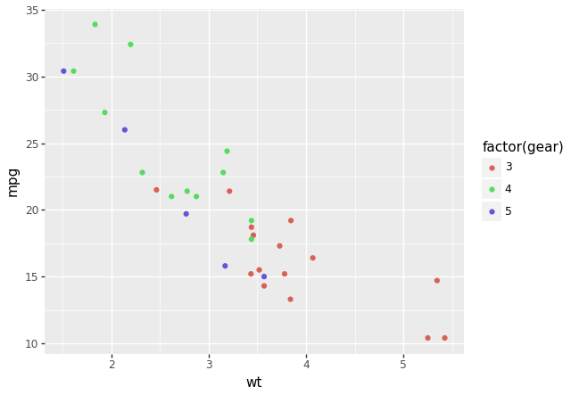
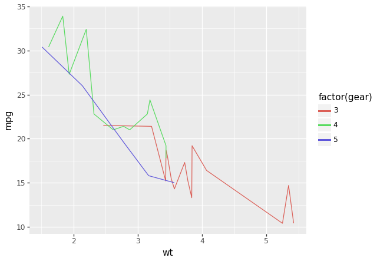
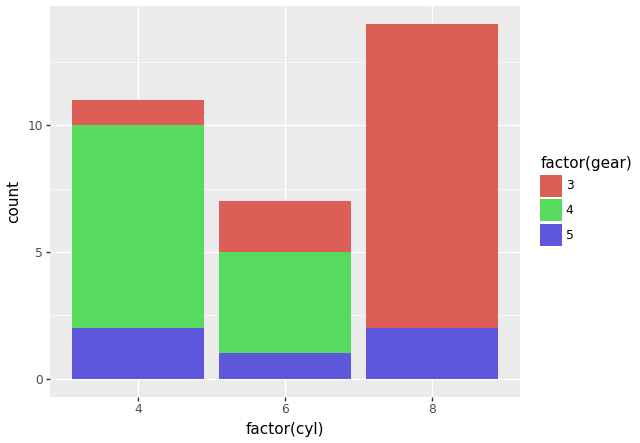
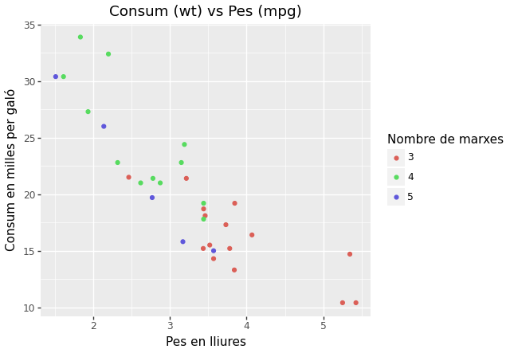
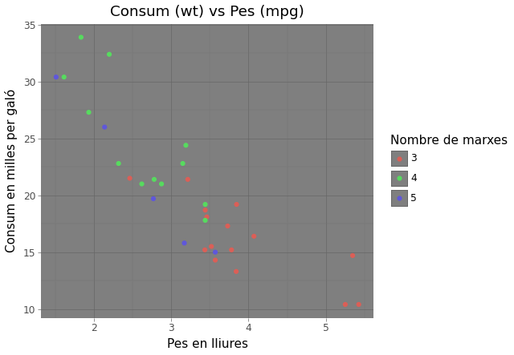

## Visualització de les dades amb Plotnine
[__`plotnine`__](https://plotnine.org)
és una llibreria de Python que permet crear gràfics de dades
de manera senzilla i elegant, inspirada en la llibreria de R `ggplot2`.

Altres llibreries de Python per a la visualització de dades són:

- [`matplotlib`](https://matplotlib.org)
- [`seaborn`](https://seaborn.pydata.org)

## Instal·lació
Per instal·lar la llibreria `plotnine` amb `pip`:

```bash
pip install plotnine
```

## Importació
Per importar la llibreria `plotnine`:

```python
from plotnine import *
```

## Utilització
La llibreria es basa en diferents objectes per a la creació de gràfics:

- `ggplot`: objecte principal que conté les dades i les capes del gràfic.
- `aes`: objecte que defineix les variables estètiques del gràfic.
- `geom`: objecte que defineix la geometria del gràfic.
- `theme`: objecte que defineix el tema del gràfic.

!!! docs
    Documentació oficial de [`plotnine`](https://plotnine.org/reference/#creating-a-plot){:target="_blank"}

!!! example
    ```python
    from plotnine import ggplot, geom_point, aes
    from plotnine.data import mtcars

    print("Dades `mtcars`:")
    print(mtcars)

    plot = (
        ggplot(mtcars)
        + aes("wt", "mpg", color="factor(gear)")
        + geom_point()
    )

    plot.show()
    ```

    
    /// figure-caption
        attrs: { id: "figure-exemple-basic" }
    Exemple bàsic amb `plotnine`.
    ///

    1. Creació d'un objecte `ggplot` amb les dades `mtcars`.
    2. Definició de les variables estètiques amb `aes`.
        - Sobre l'eix X: `wt` (pes del vehicle).
        - Sobre l'eix Y: `mpg` (consum del vehicle).
        - Color: `gear` (nombre de marxes).
    3. Definició de la geometria amb `geom_point`.
        - Cada punt representa un vehicle.

### Estètica (`aes`)
L'estètica control les propietats visuals d'una gràfica.
Aquestes funcions controlen com es mostren i distribueixen les dades (i els càlculs basats en aquestes).

La funció principal per a definir l'estètica és `aes`.

```python
aes(x, y, **kwargs)
```

- `x`: dades utilitzades per a l'eix X.
- `y`: dades utilitzades per a l'eix Y.


!!! info
    Els paràmetres `x` i `y` poden rebre múltiples tipus de dades. Podeu consultar-ho a la documentació oficial.

!!! docs
    Documentació oficial de la [`aes`](https://plotnine.org/reference/aes.html#plotnine.aes){:target="_blank"}.

Altres paràmetres comuns són:

- `color`: color dels elements.
- `fill`: color de fons dels elements.


### Geometria (`geom`)
La geometria controla el format amb que es presenten les dades.

!!! docs
    Documentació oficial de la [geometria](https://plotnine.org/reference/#geoms){:target="_blank"}.

`plotnine` ofereix diferents tipus de geometries, que venen definides per funcions amb el prefix `geom_`.
Podeu consultar la llista completa a la documentació oficial.

Els tipus de geometries més comuns són:

- [`geom_point`](https://plotnine.org/reference/geom_point.html#plotnine.geom_point){:target="_blank"}: punts.
- [`geom_line`](https://plotnine.org/reference/geom_line.html#plotnine.geom_line){:target="_blank"}: línies.
- [`geom_bar`](https://plotnine.org/reference/geom_bar.html#plotnine.geom_bar){:target="_blank"}: barres.
- [`geom_boxplot`](https://plotnine.org/reference/geom_boxplot.html#plotnine.geom_boxplot){:target="_blank"}: diagrama de caixes.

!!! example "Exemple amb punts"
    La [Figura 1](#figure-exemple-basic) mostra un exemple bàsic amb `geom_point`.

!!! example "Exemple amb línies"
    !!! info
        La funció `factor()` converteix una variable numèrica en una variable categòrica.

    ```python
    plot = (
        ggplot(mtcars)
        + aes("wt", "mpg", color="factor(gear)")
        + geom_line()
    )

    plot.show()
    ```

    
    /// figure-caption
    Exemple bàsic amb `geom_line`.
    ///

!!! example "Exemple amb barres"
    ```python
    bar_plot = (
        ggplot(mtcars)
        + aes(x='factor(cyl)', fill='factor(gear)')
        + geom_bar()
    )

    bar_plot.show()
    ```

    
    /// figure-caption
    Exemple bàsic amb `geom_bar`.
    ///

### Títol i etiquetes
Es pot especificar el títol del gràfic amb la funció
[`ggtitle`](https://plotnine.org/reference/ggtitle.html#plotnine.ggtitle){:target="_blank"}.

!!! docs
    Documentació oficial de la [funció `ggtitle`](https://plotnine.org/reference/ggtitle.html#plotnine.ggtitle){:target="_blank"}.

També es pot afegir etiquetes als eixos X i Y amb les funcions:

- [`labs`](https://plotnine.org/reference/labs.html#plotnine.labs){:target="_blank"}: Permet especificar el títol i les etiquetes dels eixos X i Y i altres elements.
- [`xlab`](https://plotnine.org/reference/xlab.html#plotnine.xlab){:target="_blank"}: etiqueta de l'eix X.
- [`ylab`](https://plotnine.org/reference/ylab.html#plotnine.ylab){:target="_blank"}: etiqueta de l'eix Y.

!!! example "Exemple amb títol i etiquetes"
    ```python
    plot = (
        ggplot(mtcars)
        + aes("wt", "mpg", color="factor(gear)")
        + geom_point()
        + labs(title="Consum (wt) vs Pes (mpg)",
               x="Pes en lliures",
               y="Consum en milles per galó",
               color="Nombre de marxes"
        )
    )

    plot.show()
    ```

    
    /// figure-caption
    Exemple amb títol i etiquetes.
    ///

### Temes
Es poden utilitzar diferents temes per a personalitzar l'aparença del gràfic.

!!! docs
    Documentació oficial dels [temes](https://plotnine.org/reference/#themes){:target="_blank"}.

Per a utilitzar un tema, s'ha d'afegir la funció `theme` al gràfic.

!!! example "Exemple amb títol i etiquetes"
    ```python
    plot = (
        ggplot(mtcars)
        + aes("wt", "mpg", color="factor(gear)")
        + geom_point()
        + labs(title="Consum (wt) vs Pes (mpg)",
               x="Pes en lliures",
               y="Consum en milles per galó",
               color="Nombre de marxes"
        )
        + theme_dark()
    )

    plot.show()
    ```

    
    /// figure-caption
    Exemple amb tema fosc.
    ///

## Codi font
- [plotnine_example.py](../../files/ud3//examples/plotnine_example.py){: download="plotnine_example.py"}

    /// collapse-code
    ```python
    --8<-- "docs/files/ud3/examples/plotnine_example.py"
    ```
    ///

## Bibliografia
- [Material del mòdul "Sistemes d'Aprenentatge Automàtic"](https://cesguiro.es/){:target="_blank"} de César Guijarro Rosaleny
- [Documentació oficial de `plotnine`](https://plotnine.org){:target="_blank"}
