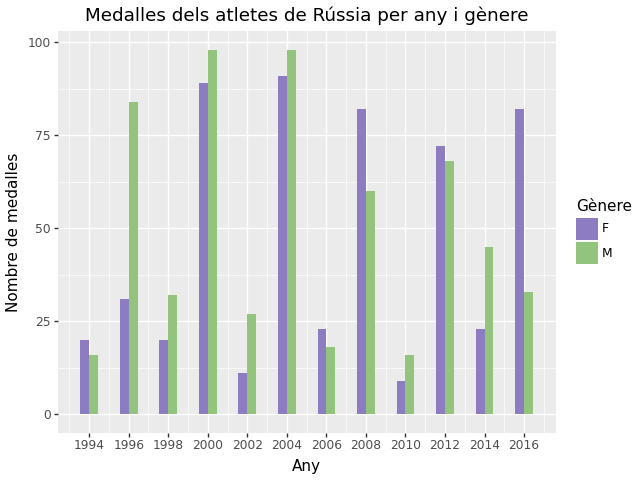

## Exercicis amb Plotnine
A partir del conjunt de dades
[120 years of Olympic history: athletes and results](https://www.kaggle.com/datasets/heesoo37/120-years-of-olympic-history-athletes-and-results){:target="_blank"},
realitza els següents exercicis amb la llibreria `plotnine`.

### Exercici 1: Medalles de Xina
#### Exercici 1.a
Crea un gràfic de barres que mostre el nombre de medalles guanyades pels atletes de la Xina en cada esport.

#### Exercici 1.b
Modifica el gràfic anterior perquè es diferencien les medalles canviant el color segons el tipus.

#### Exercici 1.c
Fes les modificacions necessàries perquè el gràfic de l'exercici anterior quede semblant a aquest:

### Exercici 2: Medalles de Rússia
#### Exercici 2.a
Crea un gràfic de barres apilades que mostre la
distribució de les medalles guanyades pels atletes de Rússia per any i gènere.

Crea els gràfics separats en dues columnes.

#### Exercici 2.b
Modifica el gràfic anterior per mostrar els gràfics en 2 files separades.

#### Exercici 2.c
Modifica el gràfic anterior per mostrar les columnes de medallistes homes i dones en el mateix gràfic.

#### Exercici 2.d
Elimina les medalles guanyades abans de 1994 del gràfic anterior.

#### Exercici 2.e
Fes les modificacions necessàries perquè el gràfic de l'exercici anterior quede semblant a aquest:

### Exercici 3: Participació als Jocs Olímpics
#### Exercici 3.a
Crea un gràfic de línies que mostre com ha evolucionat
la quantitat de participants als Jocs Olímpics al llarg dels anys similar al següent:

#### Exercici 3.b

!!! question
    Per què creus que ixen eixos dents de serra en el gràfic anterior?

Arregla les dades perquè mostren dades amb més rellevància estadística:

### Exercici 4: Participació femenina
Tria 5 esports i mostra la evolució de la participació femenina al llarg dels anys amb un gràfic:

## Bibliografia
- [Material del mòdul "Sistemes d'Aprenentatge Automàtic"](https://cesguiro.es/){:target="_blank"} de César Guijarro Rosaleny
