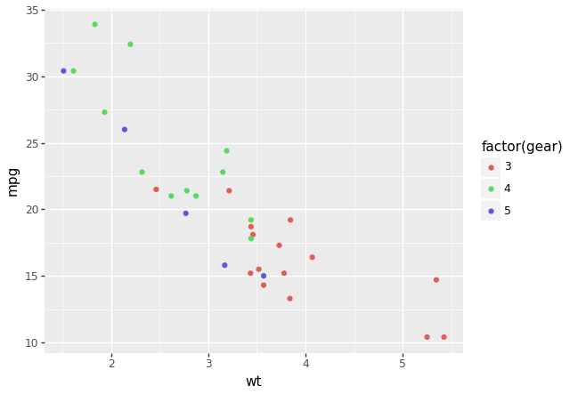

## Visualització de les dades amb Plotnine
[__`plotnine`__](https://plotnine.org)
és una llibreria de Python que permet crear gràfics de dades
de manera senzilla i elegant, inspirada en la llibreria de R `ggplot2`.

Altres llibreries de Python per a la visualització de dades són:

- [`matplotlib`](https://matplotlib.org)
- [`seaborn`](https://seaborn.pydata.org)

## Instal·lació
Per instal·lar la llibreria `plotnine` amb `pip`:

```bash
pip install plotnine
```

## Importació
Per importar la llibreria `plotnine`:

```python
from plotnine import *
```

## Utilització
La llibreria es basa en diferents objectes per a la creació de gràfics:

- `ggplot`: objecte principal que conté les dades i les capes del gràfic.
- `aes`: objecte que defineix les variables estètiques del gràfic.
- `geom`: objecte que defineix la geometria del gràfic.
- `theme`: objecte que defineix el tema del gràfic.

!!! example "Exemple"
    ```python
    from plotnine import ggplot, geom_point, aes
    from plotnine.data import mtcars

    print("Dades `mtcars`:")
    print(mtcars)

    plot = (
        ggplot(mtcars)
        + aes("wt", "mpg", color="factor(gear)")
        + geom_point()
    )

    plot.show()
    ```

    
    /// figure-caption
    Exemple bàsic amb `plotnine`.
    ///

    1. Creació d'un objecte `ggplot` amb les dades `mtcars`.
    2. Definició de les variables estètiques amb `aes`.
        - Sobre l'eix X: `wt` (pes del vehicle).
        - Sobre l'eix Y: `mpg` (consum del vehicle).
        - Color: `gear` (nombre de marxes).
    3. Definició de la geometria amb `geom_point`.
        - Cada punt representa un vehicle.

