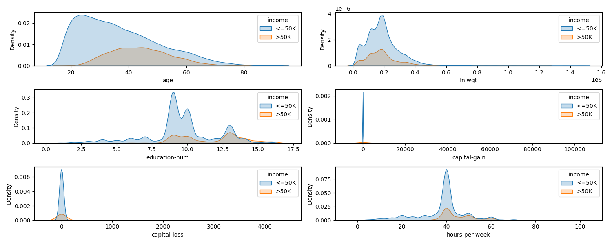
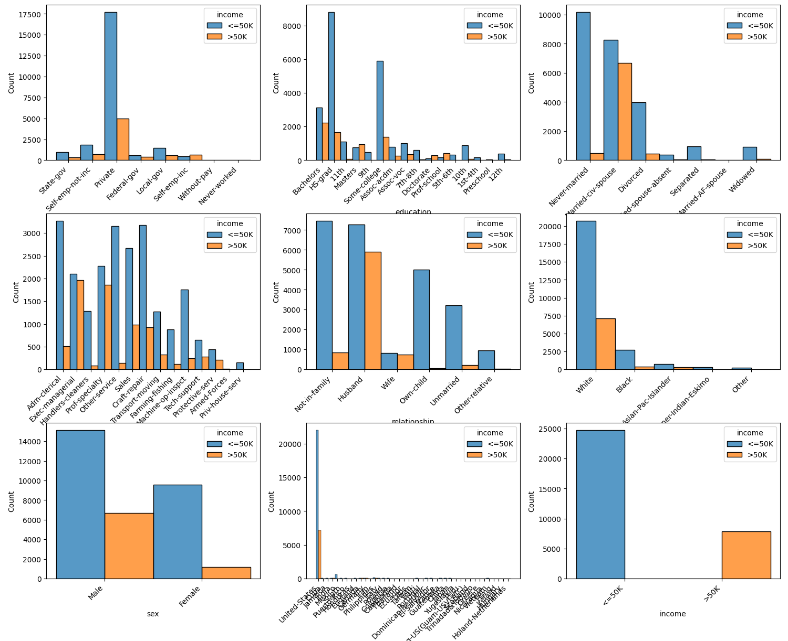
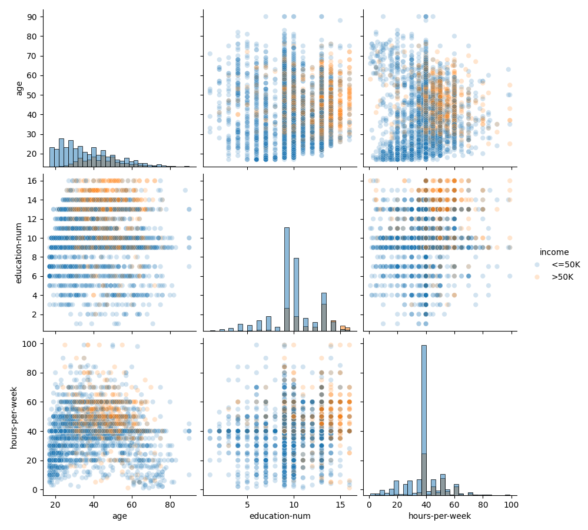
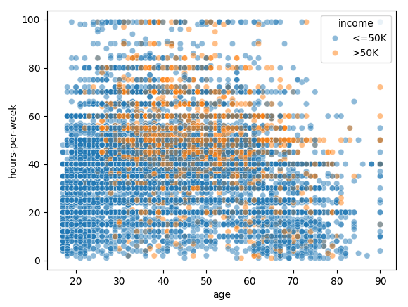
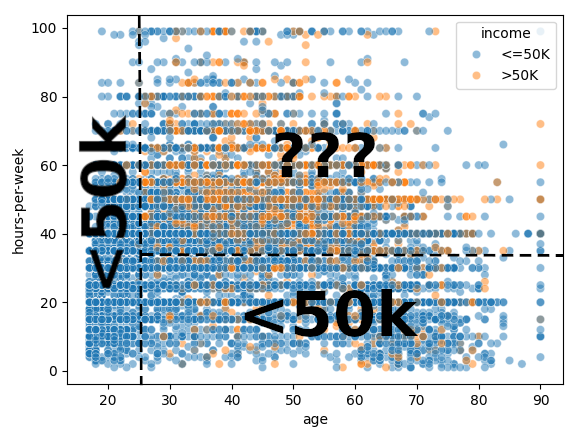
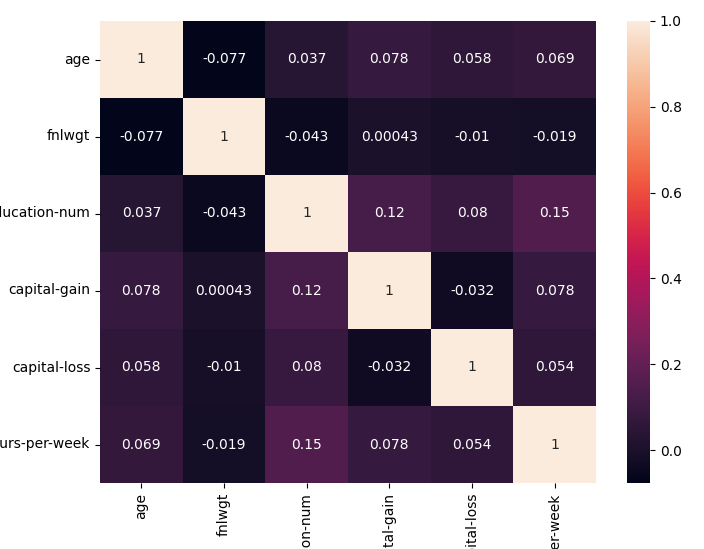
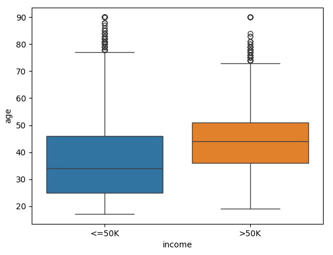

## Anàlisi visual de les dades
Un anàlisi visual de les dades és una procés que ens pot resultar útil per
entendre millor les dades amb les que estem treballant.

Cal tindre en compte que per poder representar les dades en un gràfic,
sols podem representar dues dimensions. No existeix cap gràfic que ens
permeta representar tota la informació possible, però podem fer combinacions
per trobar relacions i patrons en les dades.

!!! prep "Instal·lació de dependències"
    Aquest material utilitza les següents llibreries de Python
    per a la visualització de les dades:

    ```text title="requirements.txt"
    matplotlib
    seaborn
    ```

    ```python
    import matplotlib.pyplot as plt
    import seaborn as sns
    ```

### Distribució de les columnes respecte a les etiquetes
En els algorismes d'aprenentatge automàtic supervisat, utilitzem les etiquetes
per indicar l'eixida esperada del model. Una bona manera de començar a entendre
les dades és veure com es distribueixen les dades respecte a les etiquetes.

!!! warning
    Aquesta visualització sols és vàlida per les columnes __numèriques__.

```python
df_numerics = df.select_dtypes(include = ['float64', 'int64'])

figure=plt.figure(figsize = (15, 6))

for i, column in enumerate(df_numerics.columns, 1):
        axes = figure.add_subplot(3,2,i)
        sns.kdeplot(x = df_numerics[column], hue = df['income'], fill = True, ax = axes)
        figure.tight_layout()
plt.show()
```
/// html | div.result


//// figure-caption | <
Distribució de densitat de les columnes respecte a les etiquetes
////
///

### Histograma de les columnes
Un histograma ens permet veure la distribució de les dades d'una sola columna.

```python
figure=plt.figure(figsize = (15, 20))
 
for i, column in enumerate(df.columns, 1):
    axes = figure.add_subplot(8,2,i)
    sns.histplot(x = df[column], ax = axes)
    figure.tight_layout()
plt.show()
```
/// html | div.result


//// figure-caption | <
Histograma de les columnes
////
///

### Relació entre les columnes
Per veure la relació entre les columnes, podem utilitzar un gràfic de dispersió.

```python
n_samples_to_plot = 5000
columns = ['age', 'education-num', 'hours-per-week']
_ = sns.pairplot(data=df[:n_samples_to_plot], vars=columns,
                 hue="income", plot_kws={'alpha': 0.2},
                 height=3, diag_kind='hist', diag_kws={'bins': 30})
```
/// html | div.result


//// figure-caption | <
Relació entre les columnes
////
///

#### Fronteres de decisió
Fixem-nos en el gràfic de les columnes `age` i `hours-per-week`


/// figure-caption | < ^1
Relació entre les columnes `age` i `hours-per-week`
///

En aquest cas, podríem començar a establir fronteres de decisió per
establir si una persona guanya més de 50K o no.

!!! important
    Aquest procés és el que tractarem de realitzar d'una manera automàtica
    mitjançant els __algorismes d'aprenentatge automàtic__.


/// figure-caption | < ^1
Fronteres de decisió
///


### Correlació entre les columnes
Podem obtindre i visualitzar la matriu de correlació entre diferents columnes.

```python
corr_df = df.corr(method='pearson')
 
plt.figure(figsize=(8, 6))
sns.heatmap(corr_df, annot=True)
```
/// html | div.result

//// figure-caption | <
Matriu de correlació
////
///

### Diagrama de caixa
Els __diagrames de caixa o *box plots*__ són una manera de representar gràficament
les dades numèriques a través dels seus quartils.


/// figure-caption
Caixa dels diagrames de caixa
///

Els __limits superior $L_s$ i inferior $L_i$__ es calculen amb l'__amplitud interquartílica (IQR o _inter-quartile range_)__.

$$ IQR = Q_3 - Q_1 $$

!!! docs
    - [Viquipèdia, Diagrama de caixa](https://ca.wikipedia.org/wiki/Diagrama_de_caixa){:target="_blank"}
    - [Documentació de Seaborn, `boxplot`](https://seaborn.pydata.org/generated/seaborn.boxplot.html){:target="_blank"}
    - [Tutorials de Seaborn, `boxplot`](https://seaborn.pydata.org/tutorial/categorical.html#boxplots){:target="_blank"}

```python
sns.boxplot(x='income', y ='age', hue='income', data=df)
```
/// html | div.result

//// figure-caption | <
Diagrama de caixa
////
///

## Bibliografia
- [Material del mòdul "Sistemes d'Aprenentatge Automàtic"](https://cesguiro.es/){:target="_blank"} de César Guijarro Rosaleny
