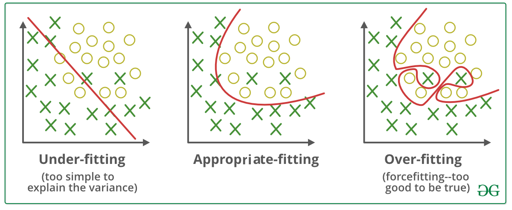
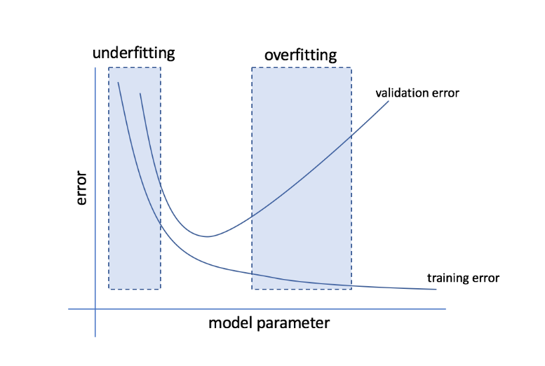

## Conjunts de dades
L'objectiu dels models d'__aprenentatge automàtic__ es trobar patrons
en les dades de manera automàtica per tal de fer prediccions o prendre
decisions.

Per aconseguir aquest objectiu, és necessari disposar de dades
per entrenar els models, que cal dividir en diferents conjunts:
__*train* (entrenament)__, __*validation* (validació)__ i __*test* (prova)__.
Cada conjunt té una finalitat específica durant el procés de
creació i avaluació del model.

La mida de cada conjunt depèn de diversos factors, com ara la quantitat
de dades disponibles, la complexitat del model, etc. No obstant això,
una divisió comuna és:

- Conjunt d'entrenament: 70-80% de les dades.
- Conjunt de validació: 10-15% de les dades.
- Conjunt de prova: 10-15% de les dades.

### Conjunt d'entrenament
El __conjunt d'entrenament__ (_training set_) és el conjunt de dades
que s'utilitza per __entrenar__ el model i ajustar els seus paràmetres.

L'objectiu d'aquest conjunt és construir un model que siga capaç
de realitzar prediccions correctes sobre dades que no ha vist abans.

### Conjunt de validació
El __conjunt de validació__ (_validation set_) és el conjunt de dades
que s'utilitza per __avaluar__ el model durant el procés d'entrenament.

L'objectiu d'aquest conjunt és valorar el rendiment del model
en el procés d'entrenament.

Aquest conjunt permet ajustar els hiperparàmetres del model (com ara
la taxa d'aprenentatge, nombre de capes de la xarxa neuronal, etc.)
per tal de millorar el seu rendiment. També ajuda a detectar
problemes com l'__sobreajustament__ (_overfitting_).


/// attribution
Autor desconegut
///
/// figure-caption
Comparació entre el sobreajustament i l'infraajustament.
///

### Conjunt de prova
El __conjunt de prova__ (_test set_) és el conjunt de dades
que s'utilitza per __avaluar__ el model després d'haver finalitzat
el procés d'entrenament.

!!! important
    Aquest conjunt de dades __no s'utilitza mai__ durant el procés
    d'entrenament del model.

L'objectiu d'aquest conjunt és avaluar el rendiment del model
amb dades que no ha vist abans i comprovar si és capaç de generalitzar
correctament el problema.


## Importància dels conjunts de dades
Els conjunts de dades són una part fonamental en el procés
d'__aprenentatge automàtic__ per diversos motius, entre els quals
podem destacar els següents.

### Prevenció de l'__sobreajustament__
El __sobreajustament__ (_overfitting_) ocorre quan un model aprén
excessivament les característiques particulars de les __dades d'entrenament__
i no és capaç de generalitzar correctament a noves dades.

Per evitar l'__sobreajustament__, s'utilitza el __conjunt de validació__
per ajustar el model i detectar el problema abans de provar-ho
amb el __conjunt de prova__.


/// attribution
Autor desconegut
///
/// figure-caption
Evolució de l'error en els conjunts de dades durant el procés d'entrenament.
///

### Evitar el biaix en l'avaluació del model
Si s'utilitza el mateix conjunt de dades per entrenar i avaluar el model,
aquest pot donar la falsa impressió que el model és millor del que realment
és, ja que el model ja coneix les dades amb les qual s'ha d'avaluar.


## Divisió de les dades en conjunts
La divisió de les dades en conjunts es pot realitzar amb diverses llibreries
de Python, com ara `scikit-learn` o `pandas`.

Una consideració important és assegurar la reproductibilitat de la divisió
de les dades, per la qual cosa és recomanable fixar la __llavor (_seed_)__
del generador de nombres aleatoris.

=== "`scikit-learn`"
    ```python
    --8<-- "docs/files/ud3/examples/conjunt_dades.py:import_pandas"

    --8<-- "docs/files/ud3/examples/conjunt_dades.py:import_sklearn"

    --8<-- "docs/files/ud3/examples/conjunt_dades.py:sklearn"
    ```

=== "`pandas`"
    ```python
    --8<-- "docs/files/ud3/examples/conjunt_dades.py:import_pandas"

    --8<-- "docs/files/ud3/examples/conjunt_dades.py:pandas"
    ```

## Codi font
!load_file "ud3/examples/conjunt_dades.py"

## Bibliografia
/// html | div.spell-ignore
- [Material del mòdul "Sistemes d'Aprenentatge Automàtic" de César Guijarro](https://cesguiro.es/){:target="_blank"} de César Guijarro Rosaleny
- [Wikipedia: Training, validation, and test sets](https://en.wikipedia.org/wiki/Training,_validation,_and_test_data_sets){:target="_blank"}
///

