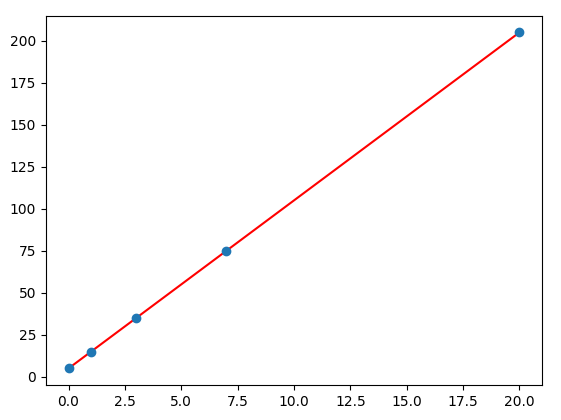

*[MAE]: Mean Absolute Error
*[MSE]: Mean Squared Error
*[RMSE]: Root Mean Squared Error


## Regressió lineal
La __regressió lineal__ és un mètode estadístic que intenta modelar
la relació entre un conjunt de variables independents $X$ (característiques o _features_)
i una variable dependent $Y$ (objectiu o _target_) mitjançant una __funció lineal__.

Quan només hi ha una variable independent, es parla de __regressió lineal simple__.
En canvi, quan hi ha més d'una variable independent, es parla de __regressió lineal múltiple__.

Aquest model lineal es pot expressar com:

$$
Y = w_0 + w_1X_1 + w_2X_2 + \ldots + w_nX_n
$$

on:

- $Y$ és la variable dependent (objectiu o _target_),
- $X_1, X_2, \ldots, X_n$ són les variables independents (característiques o _features_),
- $w_0, w_1, w_2, \ldots, w_n$ són els coeficients o pesos del model.

L'objectiu de la regressió lineal és trobar els valors dels coeficients que
millor s'ajusten a les dades.

Una vegada s'ha obtingut el model, pot ser utilitzat per fer prediccions
sobre noves dades.

???+ example "Exemple de regressió lineal simple"
    Donades les dades:

    /// html | div.columns

    | $X$ | $Y$ |
    |-----|-----|
    | 0   | 5   |
    | 1   | 15  |
    | 3   | 35  |
    | 7   | 75  |
    | 20  | 205 |

    {: style="max-height: 300px;"}
    //// figure-caption
    Dades representades en un pla cartesià.
    ////

    ///

    La regressió lineal tracta de trobar la recta que millor s'ajusta a les dades.

    $$
    Y = 10X + 5
    $$

    {: style="max-height: 300px;"}
    /// figure-caption
    Recta de regressió lineal.
    ///


## Models de regressió lineal
Els models de regressió són algoritmes que permeten trobar la recta
que millor s'ajusta a les dades.

Utilitzant la llibreria `scikit-learn` podem crear models de regressió
lineal de manera senzilla.

!!! prep "Dades d'exemple"
    Utilitzarem un conjunt de dades on es tracta de predir la nota d'un examen
    a partir de les hores d'estudi i nivell de motivació.

    ```python
    --8<-- "docs/files/ud4/examples/regressio_lineal.py:dades"
    ```

### Creació del model
Per crear un model de regressió lineal amb `scikit-learn` podem
utilitzar la classe `LinearRegression`.

!!! docs
    - [`LinearRegression`](https://scikit-learn.org/stable/modules/generated/sklearn.linear_model.LinearRegression.html){:target="_blank"}

```python
--8<-- "docs/files/ud4/examples/regressio_lineal.py:creacio_model"
```

### Entrenament del model
Per entrenar el model amb les dades, utilitzem el mètode `fit` de la classe `LinearRegression`.

```python
--8<-- "docs/files/ud4/examples/regressio_lineal.py:fit"
```

### Coeficients del model
Un cop entrenat el model, podem obtenir els coeficients de la recta.

- `coef_`: coeficients de les variables independents.
- `intercept_`: terme independent de la recta.

```python
--8<-- "docs/files/ud4/examples/regressio_lineal.py:params"
```
/// html | div.result
```
Coeficients: [1.54284641 0.57396092]
Intercept: 8.0617676396745
```
///

### Predicció amb el model
Per fer prediccions amb el model entrenat, utilitzem el mètode `predict`.

```python
--8<-- "docs/files/ud4/examples/regressio_lineal.py:predict"
```

### Avaluació del model
Per avaluar el model, podem utilitzar les mètriques de regressió.

```python
--8<-- "docs/files/ud4/examples/regressio_lineal.py:eval"
```
/// html | div.result
```
MAE: 4.19
MSE: 27.56
RMSE: 5.25
R^2: 0.58
```
///

### Visualització del model
Podem visualitzar el model de regressió lineal amb una gràfica.

```python
--8<-- "docs/files/ud4/examples/regressio_lineal.py:plot"
```
/// html | div.result


//// figure-caption
Gràfica 3D del model de regressió lineal respecte al conjunt de test.
////

///

## Codi font
!load_file "ud4/examples/metriques_regressio.py"
!load_file "ud4/examples/regressio_lineal.py"
    
/// html | div.spell-ignore
## Recursos addicionals
- [Regresión Lineal y Mínimos Cuadrados Ordinarios | DotCSV](https://www.youtube.com/watch?v=k964_uNn3l0){:target="_blank"}

## Bibliografia
- [Material del mòdul "Sistemes d'Aprenentatge Automàtic" de César Guijarro](https://cesguiro.es/){:target="_blank"} de César Guijarro Rosaleny
- [Regressió lineal – Viquipèdia](https://ca.wikipedia.org/wiki/Regressi%C3%B3_lineal){:target="_blank"}
///
