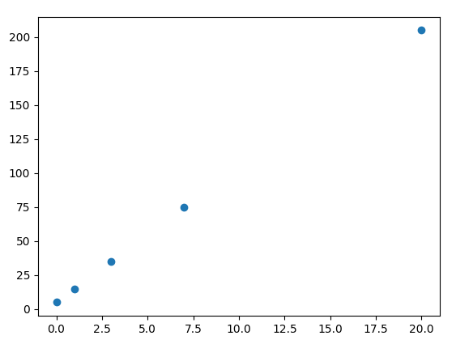
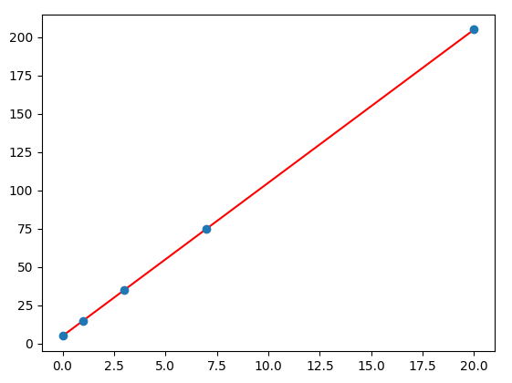
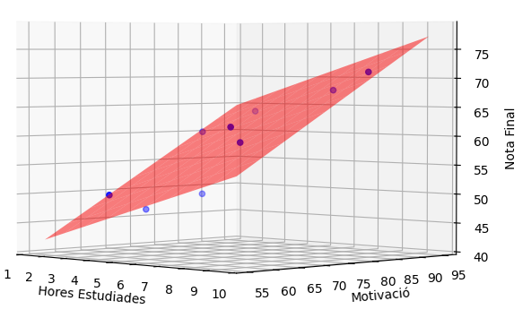

*[MAE]: Mean Absolute Error
*[MSE]: Mean Squared Error


## Regressió lineal
La __regressió lineal__ és un mètode estadístic que intenta modelar
la relació entre un conjunt de variables independents (característiques o _features_)
i una variable dependent (objectiu o _target_) mitjançant una __funció lineal__.

Aquest model lineal es pot expressar com:

$$
Y = w_0 + w_1X_1 + w_2X_2 + \ldots + w_nX_n
$$

on:

- $Y$ és la variable dependent (objectiu o _target_),
- $X_1, X_2, \ldots, X_n$ són les variables independents (característiques o _features_),
- $w_0, w_1, w_2, \ldots, w_n$ són els coeficients o pesos del model.

L'objectiu de la regressió lineal és trobar els valors dels coeficients que
millor s'ajusten a les dades.

Una vegada s'ha obtingut el model, pot ser utilitzat per fer prediccions
sobre noves dades.

???+ example "Exemple de regressió lineal"
    Donades les dades:

    /// html | div.columns

    | $X$ | $Y$ |
    |-----|-----|
    | 0   | 5   |
    | 1   | 15  |
    | 3   | 35  |
    | 7   | 75  |
    | 20  | 205 |

    {: style="max-height: 300px;"}
    //// figure-caption
    Dades representades en un pla cartesià.
    ////

    ///

    La regressió lineal tracta de trobar la recta que millor s'ajusta a les dades.

    $$
    Y = 10X + 5
    $$

    {: style="max-height: 300px;"}
    /// figure-caption
    Recta de regressió lineal.
    ///

## Mètriques de regressió
Les mètriques són mesures que ens permeten avaluar la qualitat d'un model de regressió,
que determinen com de bé s'ajusta el model a les dades i com de precises són les prediccions.

!!! prep "Dades d'exemple"
    /// html | div.columns

    | Real ($Y$) | Predicció ($\hat{Y}$) |
    |------------|-----------------------|
    | 50         | 52                    |
    | 60         | 58                    |
    | 70         | 68                    |
    | 80         | 85                    |

    ```python
    import pandas as pd

    Y = pd.Series([50, 60, 70, 80])
    pred_Y = pd.Series([52, 58, 68, 85])
    ```
    ///


### Error absolut mitjà (MAE)
L'__error absolut mitjà (Mean Absolute Error o MAE)__ és la mitjana de les diferències
absolutes entre les prediccions ($\hat{y}$) i els valors reals ($y$).

La fórmula per calcular l'error absolut mitjà és:

```math
MAE = \frac{1}{n} \sum_{i=1}^{n} |y_i - \hat{y}_i|
```

!!! example "Càlcul de l'error absolut mitjà"
    === "`pandas`"
        ```python
        --8<-- "docs/files/ud4/examples/metriques_regressio.py:mae_pandas"
        ```
    === "`scikit-learn`"
        ```python
        --8<-- "docs/files/ud4/examples/metriques_regressio.py:mae_sklearn"
        ```

    ```
    MAE: 2.75
    ```

Quan més xicotet siga el MAE, millor serà el model.
És fàcil d'interpretar ja que està expressat en les mateixes
que la variable dependent.

### Error quadràtic mitjà (MSE)
L'__error quadràtic mitjà (Mean Squared Error o MSE)__ és la mitjana de les diferències
elevades al quadrat entre les prediccions ($\hat{y}$) i els valors reals ($y$).

La fórmula per calcular l'error quadràtic mitjà és:

```math
MSE = \frac{1}{n} \sum_{i=1}^{n} (y_i - \hat{y}_i)^2
```

El MSE és més sensible als errors grans que el MAE, ja que eleva al quadrat
les diferències. Això fa que els errors més grans tinguin un pes més gran
en la mesura.

!!! example "Càlcul de l'error quadràtic mitjà"
    === "`pandas`"
        ```python
        --8<-- "docs/files/ud4/examples/metriques_regressio.py:mse_pandas"
        ```
    === "`scikit-learn`"
        ```python
        --8<-- "docs/files/ud4/examples/metriques_regressio.py:mse_sklearn"
        ```

    ```
    MSE: 9.25
    ```

### Arrel de l'error quadràtic mitjà (RMSE)
L'__arrel de l'error quadràtic mitjà (Root Mean Squared Error o RMSE)__ és la
arrel quadrada del MSE.

```math
RMSE = \sqrt{\frac{1}{n} \sum_{i=1}^{n} (y_i - \hat{y}_i)^2}
```

Aquesta mètrica és equivalent al MSE però més fàcil d'interpretar,
ja que expressada en les mateixes unitats que la variable dependent.

!!! example "Càlcul de l'arrel de l'error quadràtic mitjà"
    === "`pandas`"
        ```python
        --8<-- "docs/files/ud4/examples/metriques_regressio.py:rmse_pandas"
        ```
    === "`scikit-learn`"
        ```python
        --8<-- "docs/files/ud4/examples/metriques_regressio.py:rmse_sklearn"
        ```

    ```
    RMSE: 3.04
    ```

### Coeficient de determinació
El __coeficient de determinació ($R^2$)__ és una mesura que indica com de bé
s'ajusta el model als valors reals.

El coeficient de determinació pot prendre valors entre 0 i 1, sent 1 el millor valor
possible. Un valor de 0 indica que el model no s'ajusta als valors reals.

El coeficient de determinació es pot calcular com:

```math
R^2 = 1 - \frac{\sum_{i=1}^{n} (y_i - \hat{y}_i)^2}{\sum_{i=1}^{n} (y_i - \bar{y})^2}
```

On:

- $y_i$ són els valors reals.
- $\hat{y}_i$ són les prediccions del model.
- $\bar{y}$ és la mitjana dels valors reals.


!!! example "Càlcul del coeficient de determinació $R^2$"
    === "`pandas`"
        ```python
        --8<-- "docs/files/ud4/examples/metriques_regressio.py:r2_pandas"
        ```
    === "`scikit-learn`"
        ```python
        --8<-- "docs/files/ud4/examples/metriques_regressio.py:r2_sklearn"
        ```

    ```
    R^2: 0.93
    ```


## Models de regressió lineal
Els models de regressió són algoritmes que permeten trobar la recta
que millor s'ajusta a les dades.

Utilitzant la llibreria `scikit-learn` podem crear models de regressió
lineal de manera senzilla.

!!! prep "Dades d'exemple"
    Utilitzarem un conjunt de dades on es tracta de predir la nota d'un examen
    a partir de les hores d'estudi i nivell de motivació.

    ```python
    --8<-- "docs/files/ud4/examples/regressio_lineal.py:dades"
    ```

### Creació del model
Per crear un model de regressió lineal amb `scikit-learn` podem
utilitzar la classe `LinearRegression`.

!!! docs
    - [`LinearRegression`](https://scikit-learn.org/stable/modules/generated/sklearn.linear_model.LinearRegression.html){:target="_blank"}

```python
--8<-- "docs/files/ud4/examples/regressio_lineal.py:creacio_model"
```

### Entrenament del model
Per entrenar el model amb les dades, utilitzem el mètode `fit` de la classe `LinearRegression`.

```python
--8<-- "docs/files/ud4/examples/regressio_lineal.py:fit"
```

### Coeficients del model
Un cop entrenat el model, podem obtenir els coeficients de la recta.

- `coef_`: coeficients de les variables independents.
- `intercept_`: terme independent de la recta.

```python
--8<-- "docs/files/ud4/examples/regressio_lineal.py:params"
```
/// html | div.result
```
Coeficients: [1.54284641 0.57396092]
Intercept: 8.0617676396745
```
///

### Predicció amb el model
Per fer prediccions amb el model entrenat, utilitzem el mètode `predict`.

```python
--8<-- "docs/files/ud4/examples/regressio_lineal.py:predict"
```

### Avaluació del model
Per avaluar el model, podem utilitzar les mètriques de regressió.

```python
--8<-- "docs/files/ud4/examples/regressio_lineal.py:eval"
```
/// html | div.result
```
MAE: 4.19
MSE: 27.56
RMSE: 5.25
R^2: 0.58
```
///

### Visualització del model
Podem visualitzar el model de regressió lineal amb una gràfica.

```python
--8<-- "docs/files/ud4/examples/regressio_lineal.py:plot"
```


/// figure-caption
Gràfica 3D del model de regressió lineal respecte al conjunt de test.
///

## Codi font
!load_file "ud4/examples/metriques_regressio.py"
!load_file "ud4/examples/regressio_lineal.py"
    
/// html | div.spell-ignore
## Recursos addicionals
- [Regresión Lineal y Mínimos Cuadrados Ordinarios | DotCSV](https://www.youtube.com/watch?v=k964_uNn3l0){:target="_blank"}
{.spell-ignore}

## Bibliografia
- [Material del mòdul "Sistemes d'Aprenentatge Automàtic" de César Guijarro](https://cesguiro.es/){:target="_blank"} de César Guijarro Rosaleny
- [Regressió lineal – Viquipèdia](https://ca.wikipedia.org/wiki/Regressi%C3%B3_lineal){:target="_blank"}
///
