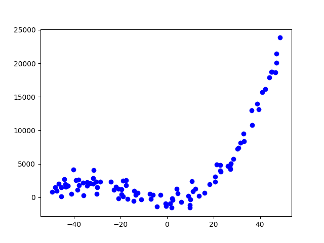
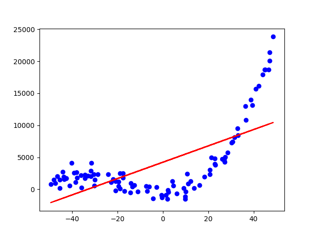
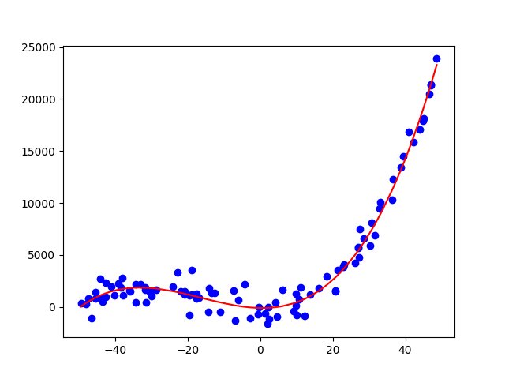

## Regressió polinòmica
La __regressió polinòmica__ és un model de regressió que intenta ajustar les dades
que no segueixen una relació lineal mitjançant un __polinomi__.

Un pàmetre important en la regressió polinòmica és el __grau del polinomi__,
que determina el nombre de coeficients per cada variable independent
que tindrà el model.

La fórmula general d'un polinomi de grau $n$ per a una variable independent $X_1$ és:

$$
Y = w_0 + w_1 X_1 + w_2 X_1^2 + \ldots + w_n X_1^n
$$

on:

- $Y$ és la variable dependent (objectiu o _target_),
- $X_1$ és la variable independent (característica o _feature_),
- $w_0, w_1, w_2, \ldots, w_n$ són els coeficients o pesos del model.


!!! example "Exemple de formula de grau 2"
    La fórmula d'un polinomi de grau 2 és amb una variable independent $X_1$ és:

    $$
    Y = w_0 + w_1 X_1 + w_2 X_1^2
    $$


En cas de tindre dues variables independents $X_1$ i $X_2$, la fórmula general d'un polinomi de grau $n$ és:

$$
Y = w_0 + w_1 X_1 + w_2 X_2 + w_3 X_1^2 + w_4 X_1X_2 + w_5 X_2^2 + \ldots + w_n X_1^n + w_{n+1} X_1^{n-1}X_2 + \ldots + w_{2n} X_2^n
$$

!!! example "Exemple de formula de grau 2 amb dues variables"
    La fórmula d'un polinomi de grau 2 amb dues variables independents $X_1$ i $X_2$ és:

    $$
    Y = w_0 + w_1 X_1 + w_2 X_2 + w_3 X_1^2 + w_4 X_1X_2 + w_5 X_2^2
    $$


L'objectiu de la regressió polinòmica és trobar els valors dels coeficients que
millor s'ajusten a les dades.


???+ prep "Preparació de les dades"

    A partir del polinomi:

    $$
    Y = -100 - 5X + 5X^2 + 0.1X^3
    $$

    Anem a generar un conjunt de dades que s'ajusten a aquest polinomi
    amb una lleugera desviació.

    ```python
    --8<-- "docs/files/ud4/examples/regressio_polinomica.py:dades"
    ```

    
    /// figure-caption
    Dades generades a partir del polinomi
    ///

???+ failure "Regressió lineal"
    Si intentem ajustar les dades amb un model de regressió lineal,
    obtenim un model incapaç de generalitzar les dades de manera correcta.

    ```python
    --8<-- "docs/files/ud4/examples/regressio_polinomica.py:regressio_lineal"
    ```
    /// html | div.result
    ```text
    RMSE linear: 18075491.24
    R^2 linear: 0.48
    ```
    ///

    
    /// figure-caption
    Regressió lineal
    ///

## Model de regressió polinòmica
Els models de regressió polinòmica són capaços
de trobar la relació no lineal entre les variables
mitjançant un polinomi.

Utilitzant la llibreria `scikit-learn` podem crear un model
de regressió polinòmica de manera senzilla.

### Creació del model
Per crear un model de regressió polinòmica amb `scikit-learn` podem
utilitzarem les següents classes i mètodes:

- [`PolynomialFeatures`][PolynomialFeatures]: Classe que genera noves característiques polinòmiques donat un grau.
- [`LinearRegression`][LinearRegression]: Classe que implementa la regressió lineal.
- [`make_pipeline`][make_pipeline]: Funció que crea una seqüència de transformacions a un estimador.

[PolynomialFeatures]: https://scikit-learn.org/stable/modules/generated/sklearn.preprocessing.PolynomialFeatures.html
[LinearRegression]: https://scikit-learn.org/stable/modules/generated/sklearn.linear_model.LinearRegression.html
[make_pipeline]: https://scikit-learn.org/stable/modules/generated/sklearn.pipeline.make_pipeline.html


```python
--8<-- "docs/files/ud4/examples/regressio_polinomica.py:model"
```

### Entrenament del model
Per entrenar el model amb les dades, utilitzem el mètode `fit` de la classe `LinearRegression`.

```python
--8<-- "docs/files/ud4/examples/regressio_polinomica.py:fit"
```

### Coeficients del model
Una vegada s'ha entrenat el model, podem obtenir els coeficients del polinomi
obtingut.

- `coef_`: coeficients de les variables independents.
- `intercept_`: terme independent de la recta.

```python
--8<-- "docs/files/ud4/examples/regressio_polinomica.py:params"
```
/// html | div.result
```
Coeficients: [-5.87635004  5.00160649  0.10233048]
Intercept: -93.53697809192136
```
///

=== "Polinomi original"

    $$
    Y = -100 - 5X + 5X^2 + 0.1X^3
    $$

=== "Polinomi regressió polinòmica"

    $$
    Y = -93.54 - 5.88X + 5.00X^2 + 0.10X^3
    $$


### Predicció i avaluació amb el model
Una vegada entrenat, podem fer prediccions amb el model i avaluar-lo.

```python
--8<-- "docs/files/ud4/examples/regressio_polinomica.py:predict"
```
/// html | div.result
```
RMSE polinòmica: 817158.83
R2 polinòmica: 0.98
```
///

### Visualització del model
Podem visualitzar el model de regressió lineal amb una gràfica.

```python
--8<-- "docs/files/ud4/examples/regressio_polinomica.py:plot_polinomica"
```
/// html | div.result


//// figure-caption
Model de regressió polinòmica
////

///

## Codi font
!load_file "ud4/examples/regressio_polinomica.py"
    
/// html | div.spell-ignore

## Recursos addicionals
- [Regresión Lineal y Mínimos Cuadrados Ordinarios | DotCSV](https://www.youtube.com/watch?v=k964_uNn3l0){:target="_blank"}


## Bibliografia
- [Material del mòdul "Sistemes d'Aprenentatge Automàtic" de César Guijarro](https://cesguiro.es/){:target="_blank"} de César Guijarro Rosaleny
- [Regressió polinòmica – Viquipèdia](https://ca.wikipedia.org/wiki/Regressi%C3%B3_polin%C3%B2mica){:target="_blank"}
- [Polynomial Regression in Python using scikit-learn (with a practical example)](https://data36.com/polynomial-regression-python-scikit-learn/){:target="_blank"}
///
