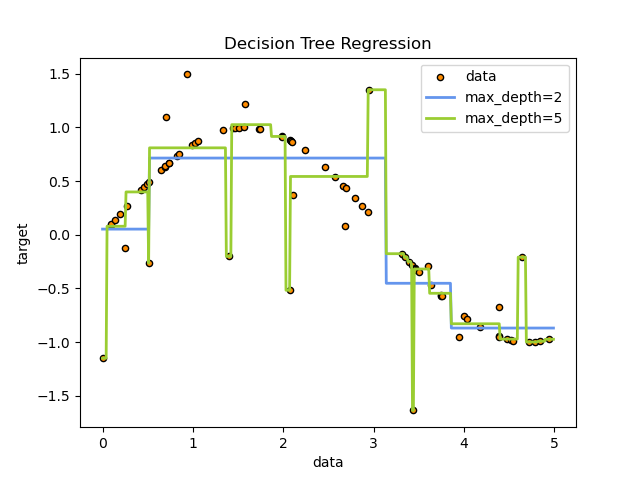
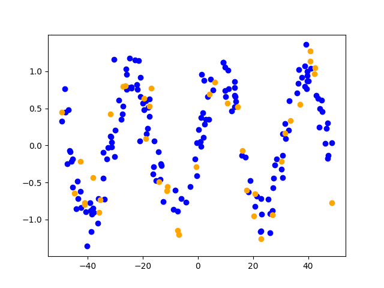
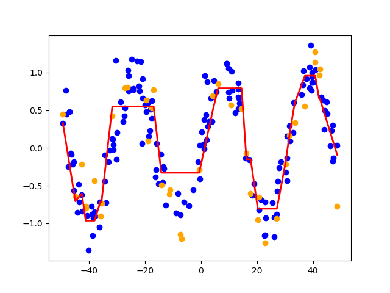
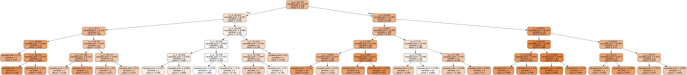

*[DT]: Decision Tree

## Regressió amb arbres de decisió
Els __arbres de decisió__ (_decision trees_ o _DT_) són models d'aprenentatge automàtic
supervisat que poden resoldre problemes de classificació i regressió.

Aquests models es basen l'aprenentatge de decisions simples a partir de les dades
en forma d'estructura d'arbre.

=== "Classificació"
    {: style="max-width: 800px;"}
    /// attribution
    [scikit-learn: Decision Trees](https://scikit-learn.org/stable/modules/tree.html#classification){:target="_blank"}
    ///
    /// figure-caption
    Exemple d'arbre de decisió de classificació del [conjunt de dades Iris](https://en.wikipedia.org/wiki/Iris_flower_data_set){:target="_blank"}.
    ///

=== "Regressió"
    {: style="max-width: 800px;"}
    /// attribution
    [scikit-learn: Decision Trees](https://scikit-learn.org/stable/modules/tree.html#classification){:target="_blank"}
    ///
    /// figure-caption
    Exemple d'arbre de decisió de regressió de la funció $\sin(x)$.
    ///


## Model de regressió amb arbres de decisió
Els arbres de decisió poden ser utilitzats per resoldre problemes de regressió.

Podem crear un model de regressió amb arbres de decisió amb __scikit-learn__
mitjançant la classe `DecisionTreeRegressor`.

!!! docs
    Documentació oficial de [`DecisionTreeRegressor`](https://scikit-learn.org/stable/modules/generated/sklearn.tree.DecisionTreeRegressor.html){:target="_blank"}

???+ prep "Preparació de les dades"
    Anem a generar un conjunt de dades que s'ajusten la funció $\sin(x)$ amb una lleugera desviació.

    ```python
    --8<-- "docs/files/ud4/examples/arbres_decisio.py:dades"
    ```

    
    /// figure-caption
    Dades generades a partir de la funció $\sin(x)$.
    ///


### Creació del model
El model `DecisionTreeRegressor` té el hiperparàmetre `max_depth` que determina la profunditat màxima de l'arbre de decisió.

Un valor massa alt d'aquest paràmetre pot provocar __sobreajustament (_overfitting_)__.

```python
--8<-- "docs/files/ud4/examples/arbres_decisio.py:model"
```


### Entrenament del model
Per entrenar el model amb les dades, utilitzem el mètode `fit` de la classe `DecisionTreeRegressor`.

```python
--8<-- "docs/files/ud4/examples/arbres_decisio.py:fit"
```

### Predicció i avaluació del model
Una vegada entrenat, podem fer prediccions amb el model i avaluar-lo.

```python
--8<-- "docs/files/ud4/examples/arbres_decisio.py:predict"
```
/// html | div.result
```
RMSE arbre decisió: 0.11
R2 arbre decisió: 0.81
```
///


## Visualització de l'arbre de decisió
Podem visualitzar l'arbre de decisió de les dades de prova
amb una gràfica.

```python
--8<-- "docs/files/ud4/examples/arbres_decisio.py:plot"
```
/// html | div.result

//// figure-caption
Model de regressió mitjançant arbre de decisió.
////
///

També podem visualitzar l'arbre de decisió amb la llibreria `graphviz`.

```python
--8<-- "docs/files/ud4/examples/arbres_decisio.py:plot_tree"
```
/// html | div.result

//// figure-caption
Arbre de decisió generat pel model.
////
///

## Codi font
!load_file "ud4/examples/arbres_decisio.py"

/// html | div.spell-ignore
## Recursos addicionals
- [¿Qué es Decision Tree y Random Forest? | MindMachineTV](https://www.youtube.com/watch?v=tYPi6qcCQbg)

## Bibliografia
- [Material del mòdul "Sistemes d'Aprenentatge Automàtic" de César Guijarro](https://cesguiro.es/) de César Guijarro Rosaleny	
- [Decision Trees - scikit-learn](https://scikit-learn.org/stable/modules/tree.html)
- [Decision Tree - Wikipedia](https://en.wikipedia.org/wiki/Decision_tree)
///
